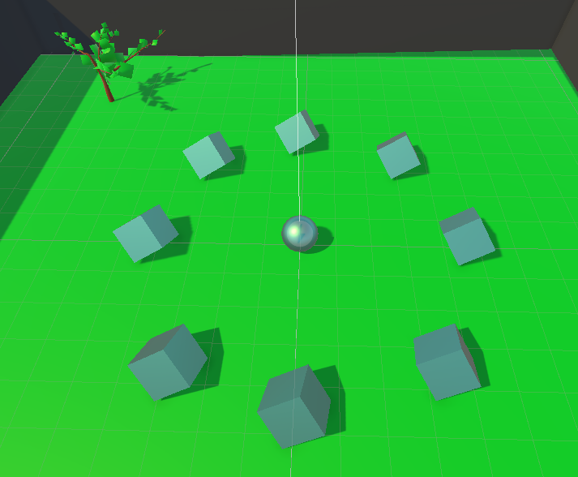
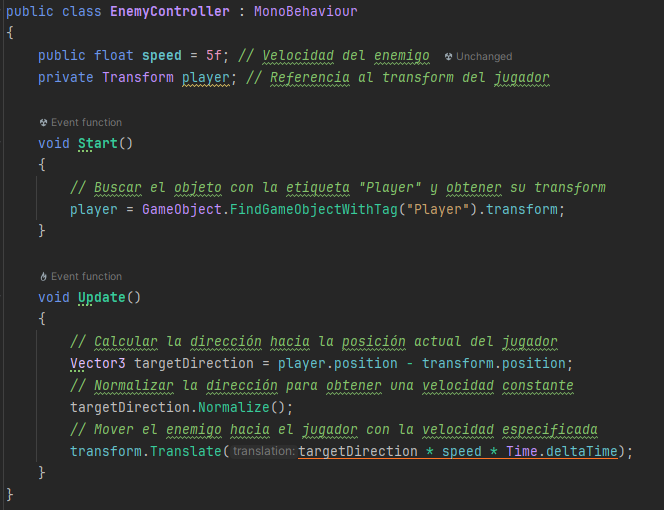
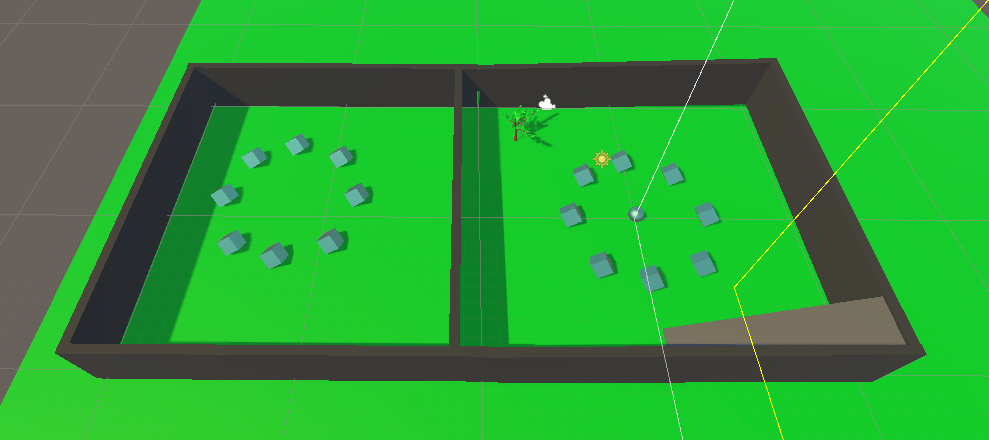
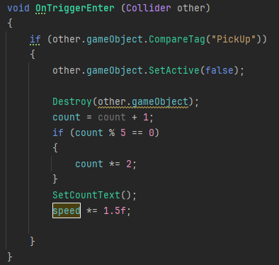
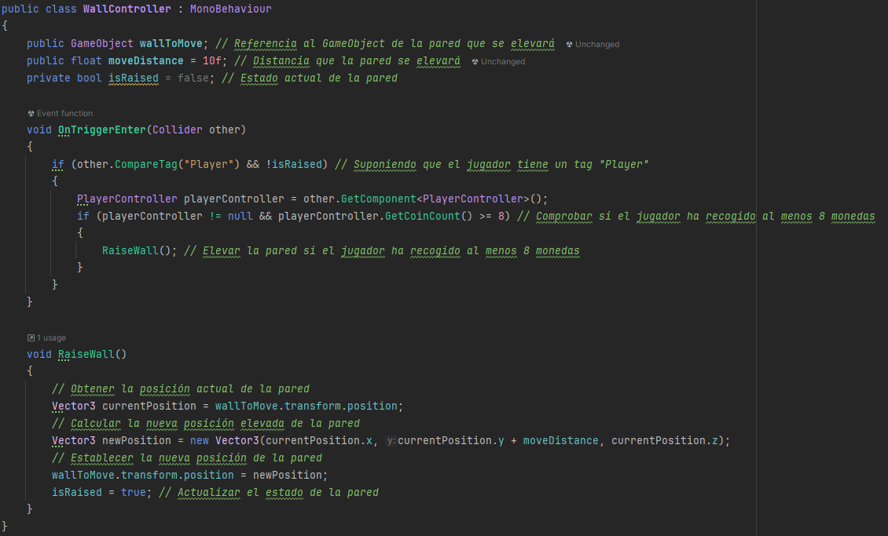

# Roll A Boll Personalizado

Este proyecto parte de la base de un sencillo Roll a Ball, en este proyecto añadiremos diferentes funcionamientos como por ejemplo elevar una parte del escenario en el momento que el jugador recoja x número de monedas otrs de los nuevos funcionamientos es la modificación de la velocidad del jugador cada vez que el jugador recoge una moneda y como estas diferentes funciones nuevas.

## Primera Modificación

La primera funcionalidad nueva que añadí al proyecto es la aparición de un enemigo el cual nos perseguirá durante el juego, el enemigo en cuestión en el proyecto es un árbol.

En cuanto al código que implemente para recrear la función donde el enemigo persigue al jugador, tuve que implementar un nuevo script en el cual el enemigo busca la posición del jugador y lo persigue. 

## Segunda Modificación

La segunda funcionalidad que he agregado al proyecto va de la mano de la anterior, en este caso el jugador cada vez que recoja una moneda la velocidad del mismo se vera aumentada en un 50% para hacer más sencilla la persecución del enemigo.

Para esta funcionalidad la única modificación en cuanto a código es la siguiente: dentro de la función que recoge que el jugador consigue una moneda añadiremos la velocidad se vea aumentada en un 1.5 por cada moneda.

## Tercera Modificación 

La tercera modificación es una modificación en cuanto al escenario del juego, en este paso añadiremos diferentes objetos cuya funcionalidad sea dificultar el nivel del juego.

## Cuerta Modificación

Esta cuarta moificacion tiene la funcion de duplicar el numero de monedas que tiene el jugador cada 5 monedas.

En cuanto al código se implemente un simple if el cual multiplica la cantidad de monedas cuando detecta que va a ser la quinta moneda.

## Quinta modificación

Esta última modificación hace que uno de los muros que rodean el escenario principal del juego este se eleve desbloqueando un escenario secundario del juego, para que este se eleve es necesario que el jugador recoja un número de monedas.

Para esta modificación es necesario crear un nuevo script donde mediante un getter recogeremos la cantidad de monedas que tiene el jugador y en el momento que la cantidad de monedas sea igual a la cantidad de monedas que pide el script el muro se elevara y desbloqueara el escenario secundario el cual tendrá nuevos obstáculos y nuevas monedas.

